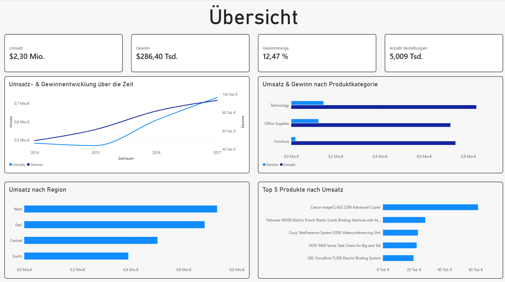
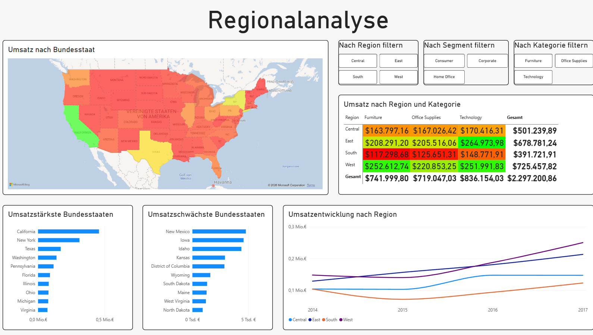
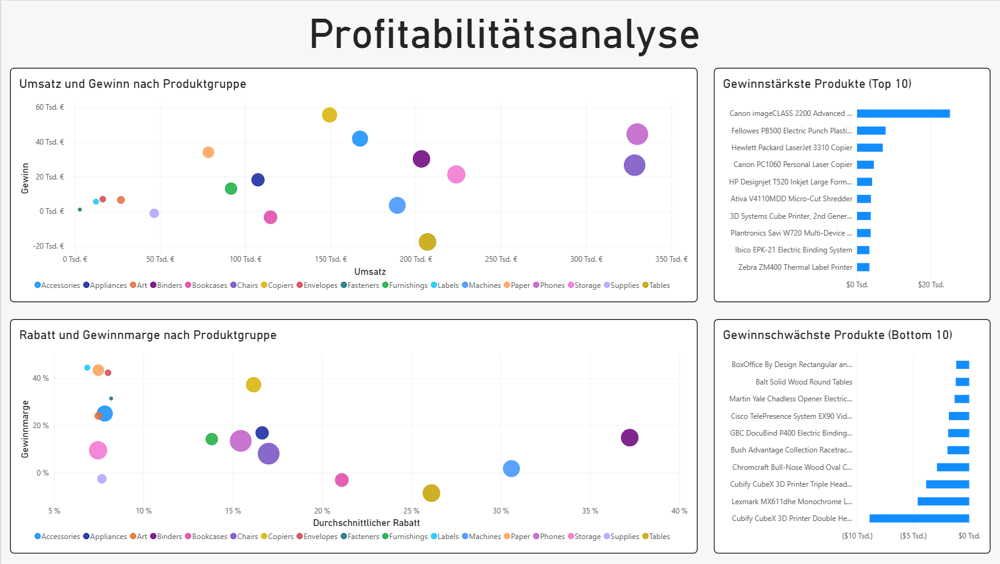

# Superstore – Umsatz- und Profitabilitätsanalyse (Power BI)

Ein dreiseitiges, interaktives Power-BI-Dashboard zur Analyse von Umsatz, Gewinn und Profitabilität eines fiktiven US-Einzelhandelsunternehmens ("Sample Superstore"). Entstanden als zweites Portfolio-Projekt in den Semesterferien, um praktische Erfahrung mit Power BI, Power Query und DAX zu sammeln.

## Datensatz

[Sample Superstore Dataset](https://www.kaggle.com/datasets/vivek468/superstore-dataset-final) (Kaggle) – ca. 9.994 Bestellpositionen eines fiktiven US-Einzelhandelsunternehmens mit Angaben zu Umsatz, Gewinn, Rabatt, Produktkategorie, Kunde, Region und Bundesstaat über mehrere Jahre.

## Aufbau des Dashboards

### Seite 1 – Übersicht
Schneller Gesamtüberblick über die wichtigsten Kennzahlen: Umsatz- und Gewinnentwicklung über die Zeit, Umsatz nach Produktkategorie und Region, Top-5-Produkte nach Umsatz.



### Seite 2 – Regionalanalyse
Detaillierte geografische Auswertung: Umsatz nach Bundesstaat (Flächenkartogramm), umsatzstärkste und -schwächste Bundesstaaten, Umsatzentwicklung je Region über die Zeit, sowie eine Matrix mit bedingter Formatierung (Umsatz nach Region und Kategorie). Mit Slicern nach Region, Segment und Kategorie filterbar.



### Seite 3 – Profitabilitätsanalyse
Die analytisch tiefste Seite: Zwei Streudiagramme zeigen den Zusammenhang zwischen Umsatz und Gewinn sowie zwischen Rabatt und Gewinnmarge je Produktgruppe, ergänzt um die gewinnstärksten und -schwächsten Produkte.



## Erkenntnisse aus der Analyse

- **Rabatt und Gewinnmarge hängen zusammen:** Produktgruppen mit geringerem durchschnittlichem Rabatt weisen tendenziell eine höhere Gewinnmarge auf. Am deutlichsten zeigt sich das bei Tables: hohe Umsätze, aber durch überdurchschnittlich hohe Rabatte eine negative Marge.
- **Nicht jeder Umsatz ist gleich profitabel:** Copiers erzielen bei mittlerem Umsatz den höchsten Gewinn und sind damit die profitabelste Produktgruppe, während Paper bei niedrigem Umsatz eine überdurchschnittlich hohe Marge erreicht – eine kleine, aber profitable Nische.
- **Regionale Unterschiede:** South ist mit Abstand die umsatzschwächste Region, während West und East deutlich stärker abschneiden – die Matrix mit bedingter Formatierung macht das auf einen Blick sichtbar.
- **Geografische Konzentration:** Texas gehört trotz eines der umsatzstärkeren Bundesstaaten zu den Staaten mit dem niedrigsten Gewinn – ein Hinweis darauf, dass hohe Verkaufszahlen nicht automatisch mit Profitabilität einhergehen.

## Tech Stack

- Power BI Desktop
- Power Query (Datenimport, -bereinigung, Datentyp- und Formatkorrekturen)
- DAX (eigene Measures)

## DAX-Measures

```dax
Umsatz = SUM('Sample - Superstore'[Sales])
Gewinn = SUM('Sample - Superstore'[Profit])
Profit Margin = DIVIDE(SUM('Sample - Superstore'[Profit]), SUM('Sample - Superstore'[Sales]))
Anzahl Bestellungen = DISTINCTCOUNT('Sample - Superstore'[Order ID])
```

## Was ich dabei gelernt habe

Im Gegensatz zu meinem ersten Projekt (Python/SQL) war der Einstieg in Power BI deutlich klick-basierter, dafür lagen die Herausforderungen an anderer Stelle. Besonders gelernt habe ich:

- Datenimport und -bereinigung in Power Query, inklusive Debugging von zwei nicht offensichtlichen Formatierungsproblemen: Datumswerte wurden zunächst im falschen Ländereinstellungs-Format interpretiert (US- statt deutsches Format), und Zahlenwerte (Sales, Profit) wurden anfangs durch eine Punkt/Komma-Verwechslung um mehrere Größenordnungen falsch berechnet. Beide Fehler ließen sich durch kritisches Hinterfragen der Ergebniswerte (Plausibilitätscheck) aufdecken und über die Gebietsschema-Einstellung beim Datentyp beheben.
- Grundlagen von DAX: eigene Measures mit `SUM`, `DIVIDE` und `DISTINCTCOUNT`
- Den Unterschied zwischen verschiedenen Aggregationsarten und warum die richtige Wahl (z. B. Durchschnitt statt Summe bei Rabatten) für aussagekräftige Analysen entscheidend ist
- Den Aufbau eines mehrseitigen Dashboards mit konsistentem Layout, Slicern und einer klaren erzählerischen Struktur (Überblick → Detailanalyse → Tiefenanalyse)

## Hinweis zu den Daten

Die Originaldaten sind in US-Dollar angegeben (fiktives US-Unternehmen); die Formatierung wurde entsprechend auf USD eingestellt, auch wenn das Dashboard sonst auf Deutsch beschriftet ist.
